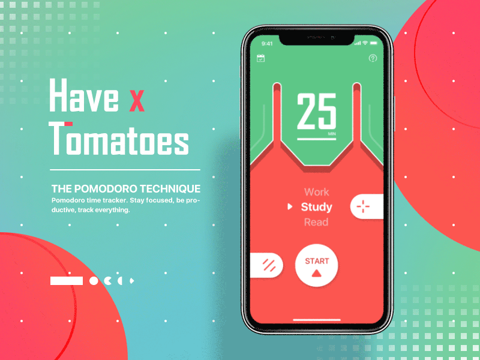

# Pomodoro 🍅⏳

iOS Pomodoro application - stay focus on a task and take a break after.

This application is based on the time management method called `Pomodoro`. You split your tasks in several intervals, each one lasts generaly 25 minutes, and at the end of the time, you take a small break before to start the next session [Wikipedia](https://en.wikipedia.org/wiki/Pomodoro_Technique).

The name comes from the italian word `tomato` after the tomato-shaped kitchen timer that the method creator used as a student.

The design of the application is based on a [very beautiful concept](https://dribbble.com/shots/4073004-Have-X-Tomatoes?_=1550051888886) discovered on Dribble.

### iOS world discovery for an Android developer

After 4 years of Android development, I start to develop iOS application for the company I work for. 

It's still new for me so if you find any no iOS way to code, bad design pattern for an iOS app or if there is better way to do some things, don't hesitate to open an issue. I continue to learn new things day after day.

